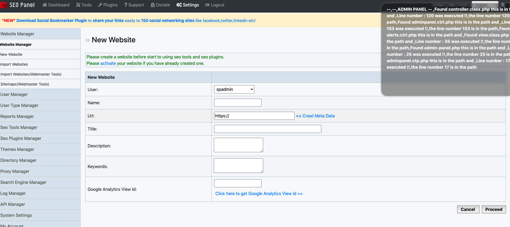
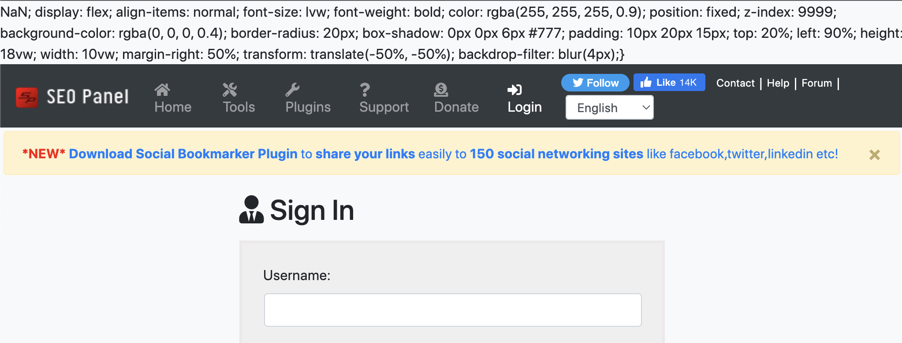

# PHP-Guided-Path-Explorer

## Temporary Instrumentation for Demo

To prepend a file so it is parsed before the main script, we add the following setting to the .htaccess file, 
php.ini (which of course would affect all websites):

`php_value auto_prepend_file prepend.php`

`php_value auto_append_file append.php`

The prepend file contains a pathlist - that will be edited in later bugfixes. 

## Temporary Demo Image 

### Potential XSS list 

This has little value, but extension accidentally broke the application, despite respecting Same Origin Policy.
further analysis required.

